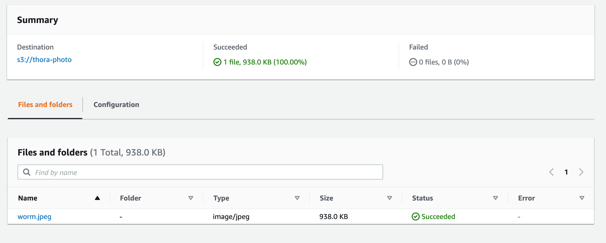
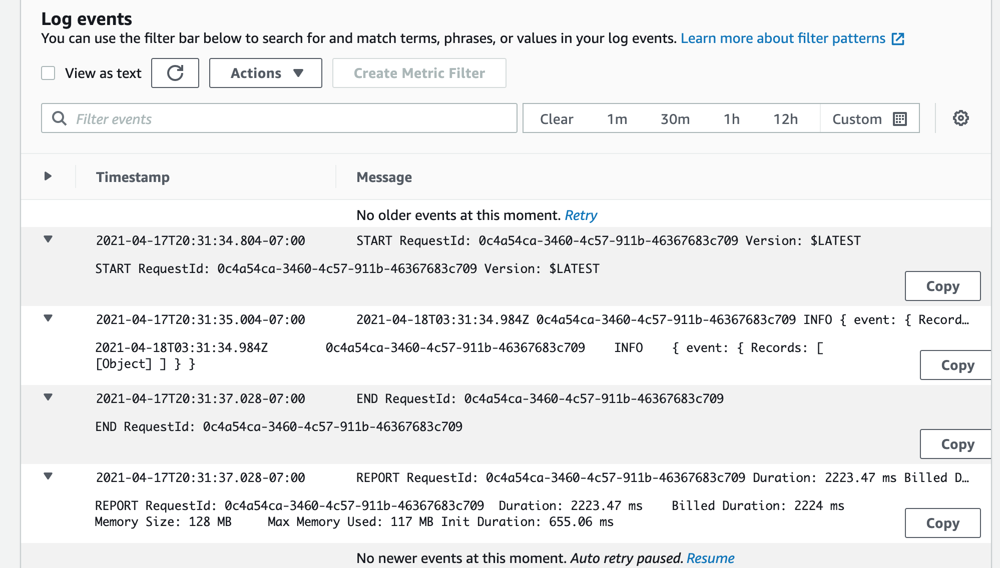
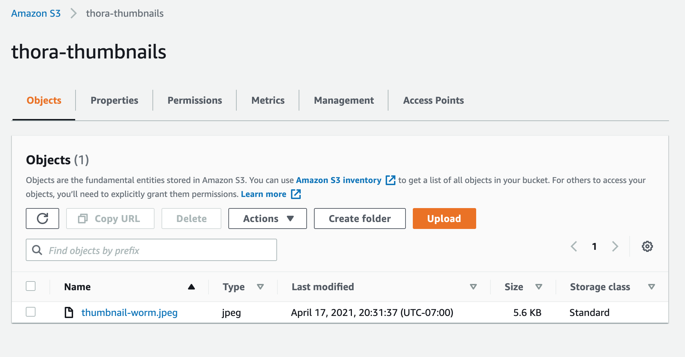

# image-lambda
The AWS works as follows:

## Original Upload S3 Bucket

Step 1. User uploads photo to the s3 bucket thora-photo; put actions to this bucket then trigger the function

## Lambda Function to Create/Save Thumbnail

Step 2. Uploading to the s3 bucket getThumbnail - which is a lambda function that takes the input file and resizes it to a width of 200px (height is determined automatically); then the function saves the smaller image to the s3 bucket thora-thumbnails

## Destination S3 Bucket

Step 3. Smaller file gets saved into the destination s3 bucket.

## Notes about this process

- Initial troubleshooting between OS I am using and the linux system where the npm install is actually run are different, solution: uninstall npm packages and reinstall with flags specifying linux system

- I haven't figured out that automatic deploy yet in GitHub Actions, but after the troubleshooting process of today that sure moved up into a higher priority !!

- "White Worm" is the name of my cat, so that is what I was resizing photos of :)
